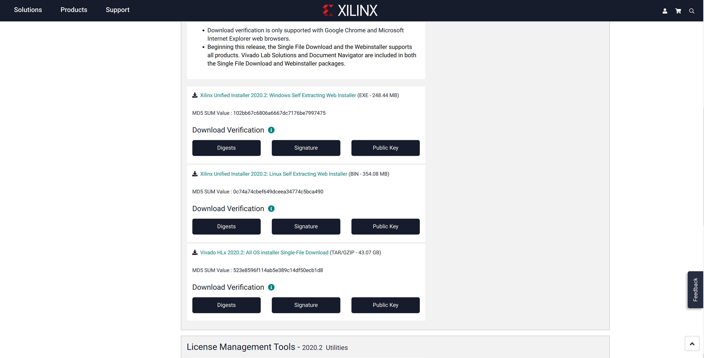
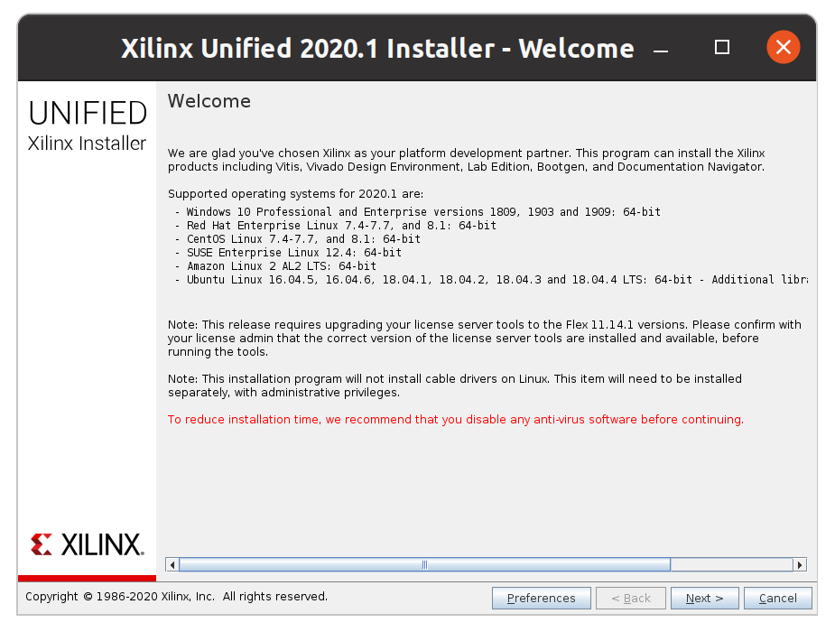
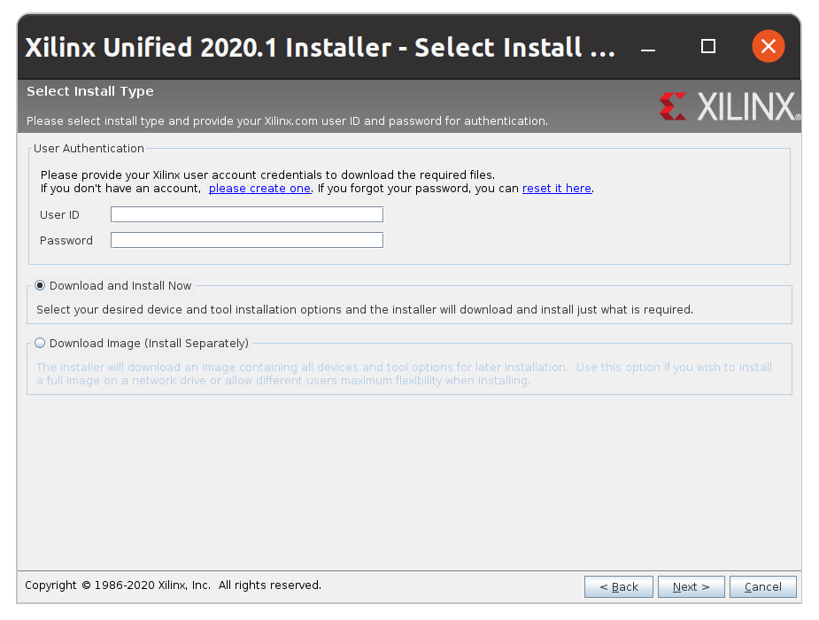
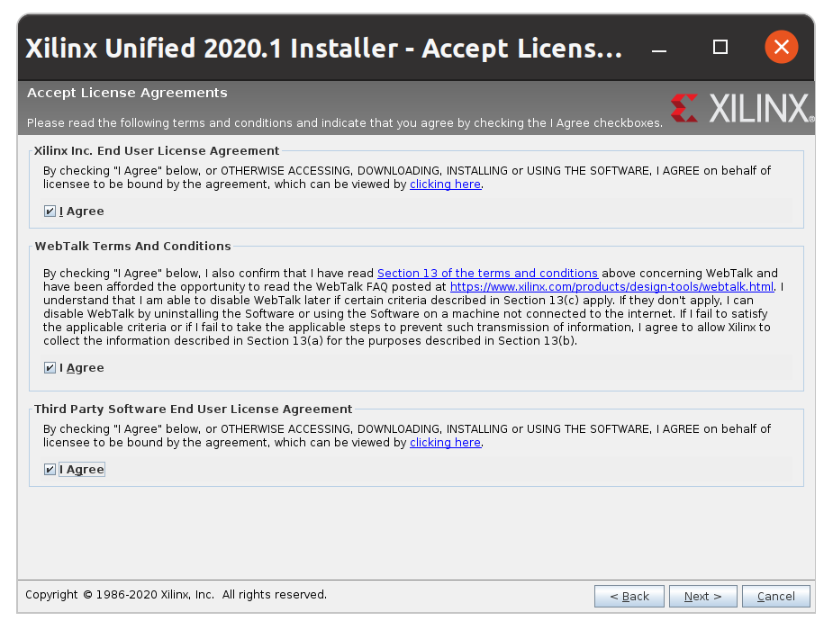
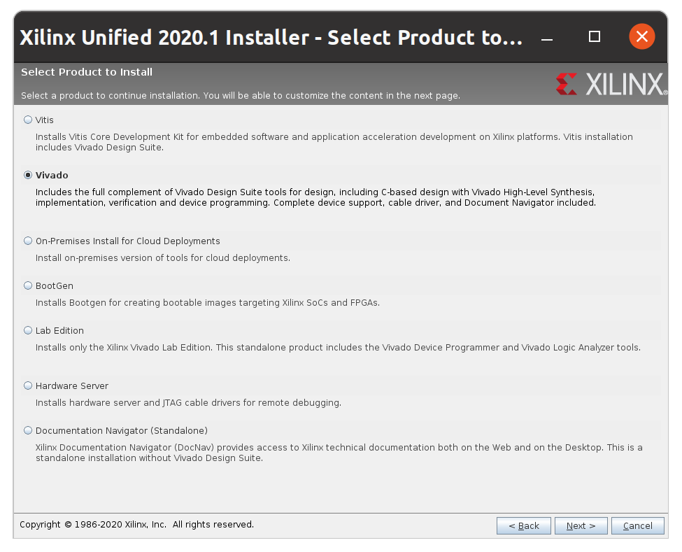
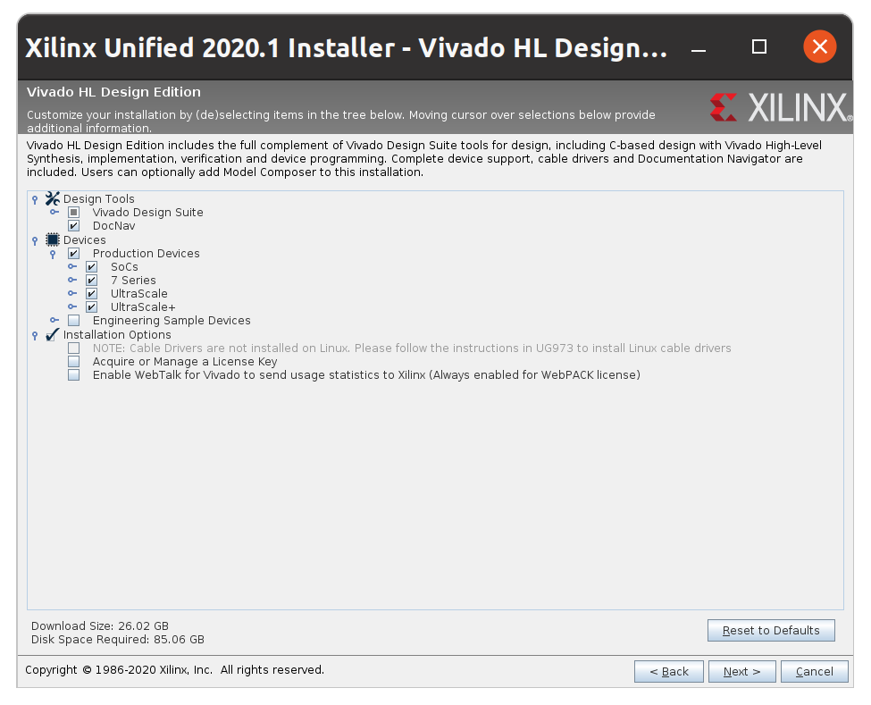
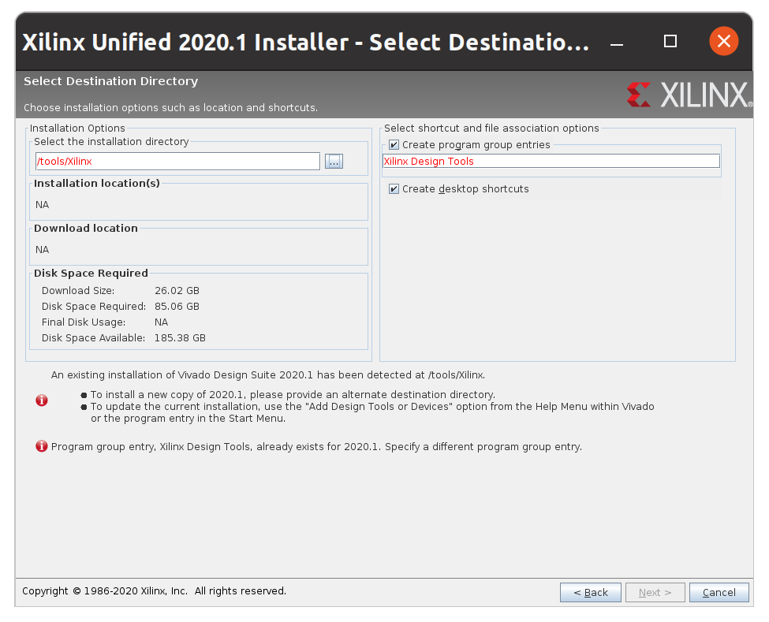
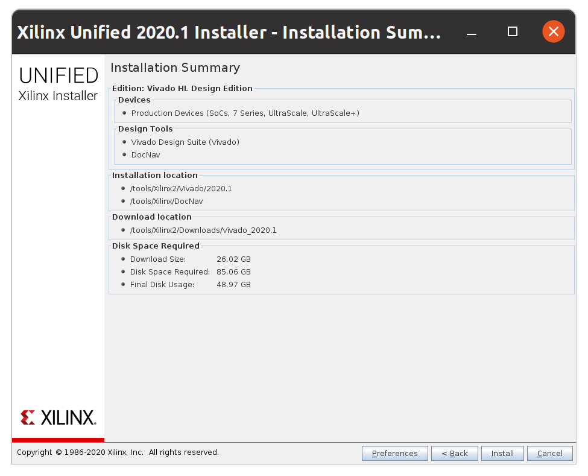
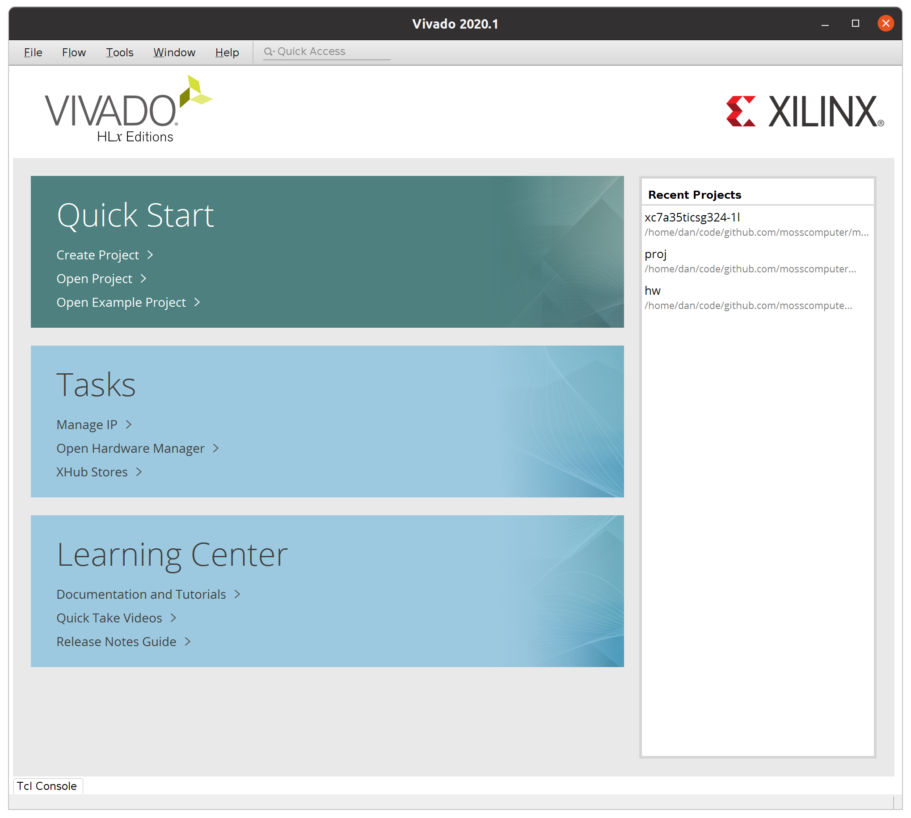

+++ 
draft = false
date = 2020-12-06T05:51:26-05:00
title = "Installing Vivado 2020.x on Ubuntu 20.04"
slug = "vivado-2020-x-ubuntu-20-04" 
tags = []
categories = []
+++

[Vivado](https://www.xilinx.com/products/design-tools/vivado.html) is [Xilinx's](https://www.xilinx.com/) IDE for HDL synthesis and analysis. It is a powerful tool, but can be a bit of a pain to setup and use. I recently went through the installation process on my main development machine, where I cam currently running [Ubuntu 20.04](https://releases.ubuntu.com/20.04/), after I purchased a [Digilent Arty A7-35T](https://store.digilentinc.com/arty-a7-artix-7-fpga-development-board-for-makers-and-hobbyists/) development board, which is designed around the [Xilinx Artix-7 FPGA](https://www.xilinx.com/products/silicon-devices/fpga/artix-7.html). While it didn't take too long to get up and running (ignoring the time waiting for the actual installation to complete), I found the existing installation documentation quite verbose, which made following along more difficult than it should have been. The primary issue I (unsurprisingly) ran into was that Ubuntu 20.04 is not officially supported by Vivado 2020.1, which requires a workaround that is detailed below. The subsequent Vivado 2020.2 release has [addressed the issue](https://forums.xilinx.com/t5/Installation-and-Licensing/Xilinx-Unified-Installer-2020-1-Exception-in-thread-quot-SPLASH/m-p/1159785/highlight/true#M30552), but still does not officially support Ubuntu 20.04.

> If you prefer to follow the official documentation for installation, it can be found [here](https://www.xilinx.com/content/dam/xilinx/support/documentation/sw_manuals/xilinx2020_1/ug973-vivado-release-notes-install-license.pdf#namedDest=InstallingTheVivadoDesignSuiteTools). There is also [helpful documentation](https://reference.digilentinc.com/vivado/installing-vivado/start) from Digilent, which is especially useful if you are primarily using one of their boards.

## Downloading the Xilinx Unified Installer

Xilinx provides a number of development tools for their products and follows the familiar pattern of releasing a single unified installer that allows users to install any of them from a single entry point. The following steps describe how to download the installer for your machine.

1. Navigate to the [Xilinx Downloads Page](https://www.xilinx.com/support/download.html?_ga=2.260602445.115923376.1607278706-574785482.1605024210)

Here you should be met by a set of tabs, each with a different tool. By default, you should see `Vivado (Hardware Developer)` tab first. If you scroll down, you should see options to download the Xilinx Unified Installer Self Extracting Web Installer for a variety of platforms.




We want the Linux installer, but we will need to create a Xilinx account first. Click on the `Xilinx Unified Installer 2020.2: Linux Self Extracting Web Installer` link and you should be redirected to the Xilinx login page.

2. Create a Xilinx Account

Some Vivado editions require that you have a license. To program Artix-7 boards you should typically be fine with just using the Design Edition, which only requires a Xilinx account. Walk through the steps to create a new account and activate your user.


3. Download the Unified Installer

After you have created and activated your user, you can navigate back to the downloads page and click the link again. The installer should now download successfully.

> It is a good idea to verify the integrity of the installer after download. As pictured in the screenshots above, Xilinx provides digests, signature, and a public key for the download. The official documentation has a [great section](https://www.xilinx.com/content/dam/xilinx/support/documentation/sw_manuals/xilinx2020_1/ug973-vivado-release-notes-install-license.pdf#namedDest=InstallingTheVivadoDesignSuiteTools) on how you can verify your downloads, so I will omit those steps here for brevity.

## (Optional) Faking Your OS Version

As I mentioned in the introduction, Vivado 2020.x does not officially support Ubuntu 20.04. However, in my experience (and the experience of many others online), it mostly works just fine. Do keep in mind that it is generally not advisable to deceive a program into thinking it is running on a different platform than it is, and there is inherent risk in doing so. Additionally, you will likely be installing Vivado 2020.2 now that it is available.

That being said, if you are installing Vivado 2020.1 on an incompatible version of Ubuntu, you can fake an older OS version by editing the `/etc/os-version` file. If you do not do so, you will likely see the following output when attempting to run the installer. It program doesn't fully crash, but you won't be able to use the GUI.

```

Verifying archive integrity... All good.
Uncompressing Xilinx Installer...............................................................................................................................................................................................................................................................................................................................................................................................................................................................................................................................................................................................................................................................................................................................................................................................
Exception in thread "SPLASH_LOAD_MESSAGE" java.lang.IllegalStateException: no splash screen available
        at java.desktop/java.awt.SplashScreen.checkVisible(Unknown Source)
        at java.desktop/java.awt.SplashScreen.getBounds(Unknown Source)
        at java.desktop/java.awt.SplashScreen.getSize(Unknown Source)
        at com.xilinx.installer.gui.H.run(Unknown Source)

```

The `/etc/os-version` likely looks something like the following for you:

```

NAME="Ubuntu"
VERSION="20.04.1 LTS (Focal Fossa)"
ID=ubuntu
ID_LIKE=debian
PRETTY_NAME="Ubuntu 20.04.1 LTS"
VERSION_ID="20.04"
HOME_URL="https://www.ubuntu.com/"
SUPPORT_URL="https://help.ubuntu.com/"
BUG_REPORT_URL="https://bugs.launchpad.net/ubuntu/"
PRIVACY_POLICY_URL="https://www.ubuntu.com/legal/terms-and-policies/privacy-policy"
VERSION_CODENAME=focal
UBUNTU_CODENAME=focal

```

The specific field you will want to change is `VERSION`, and it should be set to `18.04.4` or earlier. You will need to edit as super user as `os-version` will be a read only file.

```
VERSION="18.04.4 LTS (Bionic Beaver)"
```

After saving your changes, the unified installer should run successfully.

**Make sure that you change the version back to its appropriate value after installing Vivado. Failure to do so can cause issues when running other applications on your machine.**

## Running the Unified Installer

You can run the unified installer by making it executable and running as super user.

```
chmod +x Xilinx_Unified_2020.1_0602_1208_Lin64.bin && ./Xilinx_Unified_2020.1_0602_1208_Lin64.bin
```

> Digilent documentation will specify that you run the installer as root. With newer versions, such as 2020.x, this is no longer necessary as cable driver installation has been isolated as a separate step. More on this below.

After a few seconds, you should be greeted with the Welcome window.



Here we are presented with the helpful reminder that our OS version is not supported, but we will press on. The next window will ask you to login to your Xilinx account. The same credentials you provided when creating your user at the beginning of this account should be utilized here.



Next, you'll need to agree to terms and conditions.



Now we will actually begin to customize the installation. As mentioned earlier, this installer can be used to install many different Xilinx products. The two you would likely be considering are Vivado, of course, and Vitis. Vitis is a newer development suite from Xilinx that is targeted more at software developers rather than hardware developers. The [initial press release](https://www.xilinx.com/news/press/2019/xilinx-announces-vitis--a-unified-software-platform-unlocking-a-new-design-experience-for-all-developers.html) does a pretty good of explaining the motivation behind it. This quote is particularly illustrative of when you might want to choose Vitis over Vivado:

> Vitis is separate to the Vivado® Design Suite, which will still be supported for those who want to program using hardware code, but Vitis can also boost the productivity of hardware developers by packaging hardware modules as software-callable functions.

As part of the announcement, Xilinx also announced a [new developer portal](https://developer.xilinx.com/), which has some examples that will give you an idea of what the Vitis workflow looks like. It should also be noted that, as shown in the screenshot below, installing Vitis will also install Vivado. Today we are just going to be installing Vivado as our primary goal will be programming at the hardware level.



Next we will select the version of Vivado we want to install. Since we are not purchasing a license, the `Systems Edition` will not be an option. The `WebPACK` version is a fine option for getting started, but there is a good chance you will want some of features in the `Design Edition` eventually, so it likely makes sense to go ahead and start off with it (as you will see later, it is preferable to not frequently reinstall these tools).


You will also have to configure options for your installation. I chose the defaults minus "Acquire or Manage a License Key" and "Enable WebTalk for Vivado to send usage statistics to Xilinx" (sorry Xilinx).



The final steps are to choose an installation location and confirm install. It is a large installation to say the least (see "Final Disk Usage: 48.97 GB"), and as such will take quite a long time to install. I started mine on a Saturday morning and checked back in during the afternoon and it had finished by that point.

> You should not see the same errors displayed for me as they are only due to the fact that I had previously already installed Vivado 2020.1.





Hit install and you are off to the races!

## Installing Cable Drivers

I mentioned earlier that cable drivers are now installed separately from the Vivado installation process. After your installation is complete, you should find a script that you can run to make sure the correct drivers are installed.

```
sudo ./tools/Xilinx/data/xicom/cable_drivers/lin64/install_script/install_drivers/install_drivers
```

## Launch Vivado

Vivado should be ready to go at this point. You'll need to add `vivado` to your `PATH`. Xilinx has once again provided a helper script to add the relevant executables.

```
source /tools/Xilinx/2020.1/settings64.sh
```

> This will only add to `PATH` for the current session. Add `export PATH=/tools/Xilinx/Vivado/2020.1/bin:$PATH` to `~/.profile` if you want `vivado` to be available in any session.

Now you should be able to enter `vivado` and see the following quick start window.



## Wrapping Up

Hardware programming can feel intimidating, but the more you interact with the various toolchains the more you begin to gain familiarity. I will continue to share guides and tutorials here, and, as always, please feel free to send me a message [@hasheddan](https://twitter.com/hasheddan) on Twitter with any questions or comments!
